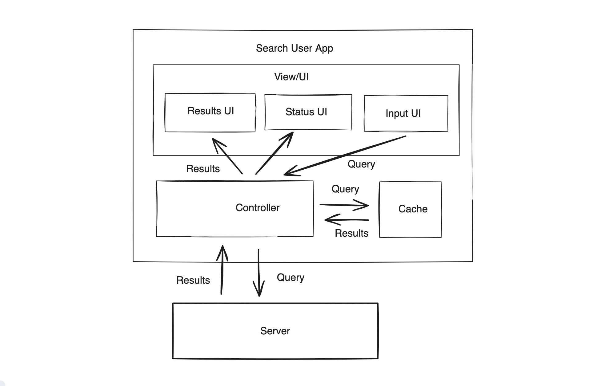

## Build a User Search Application with the GitHub API

Create a simple web app (using `ReactJs` + `Redux`) with `a live search field` that filters users from the `Github Users API` and then `lists those users in a table`.
(Github API Doc : https://docs.github.com/en/rest/reference/search#search)

When a user enters at least 3 characters into the text field, make an API request to the github endpoint, parse the resulting JSON and display the following pieces of data for the first hundred user items .­

- avatar_url : The Github user avatar (rendered as an image)­
- login: The username of the github user­
- type: The type of user.­
- score: A decimal value representing the accuracy of the result against the search term.

When an active HTTP request is in progress, place a progress indicator anywhere on the page to indicate network activity. Once the search is performed, clearing the input should also clear the list of users displayed before.

NOTE: The Github API is rate limited. Performing too many requests too quickly will end with the user's API requests being blocked for a short period of time.

## Solution

#### Architecture

##### Input Field UI

- Handles user input (React)

##### Results UI (Table)

- Receives results from State Management (Redux) and presents them to the user.

##### Status UI

- Displays the status of the request or any network errors.

##### Cache

Uses an LRU (Least Recently Used) cache to store the results of previous queries so that the controller can check the cache before sending a request to the server.

##### State Controller

- Acts as the central component where all other components interact.
- Passes user input and results between components.
- Fetches results from the server if the cache is empty for a particular query.

#### State Management

The code utilizes Redux Store and React State to manage the application's behavior and data flow:

- query [React State]: This state keeps the current search string as the user types in the search input.
- usersStore [Redux Store]:
  - `loading`: Tracks the status of the current request (in-progress, done).
  - `users`: Stores the successfully retrieved users, transformed from raw data.
  - `error`: Stores any error messages if there are issues during the request process.

#### Completed Cases:

- Minimum Query Length: To avoid irrelevant results, the search should trigger only when the query has a minimum length, typically 3 or more characters.

- Debounce Duration: Debouncing limits the number of API calls by ensuring the backend search API is called only after a delay (e.g., 300ms) following the last user input.

- Handle Race Conditions: Use AbortController to cancel previous requests before making new ones to avoid race conditions.

- Using Virtualized List: When the results contain a large number of items (hundreds or thousands), use a virtualized list to maintain performance and reduce memory usage.

- UX Considerations: Provide user feedback when the GitHub API rate limit is exceeded and auto-retry the request if the wait time to reset the quota is 3 seconds.

#### Potential Enhancements:

- Lazy Load Images: delays the loading of images until they are actually needed.

- Pagination/Sorting/Filtering: Implement these features to manage and display more data efficiently in the table.

- Improved UI/UX: Show a countdown for retrying requests after exceeding the quota limit.

- Integration/End-to-End Testing: Write tests to ensure the entire application works as expected.

- Handle Long Strings: Manage long text in result items appropriately by truncating with an ellipsis or wrapping to prevent overflow.
